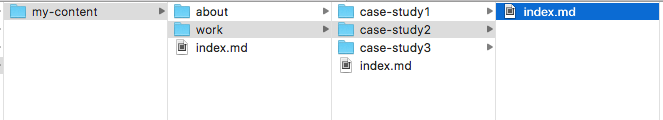
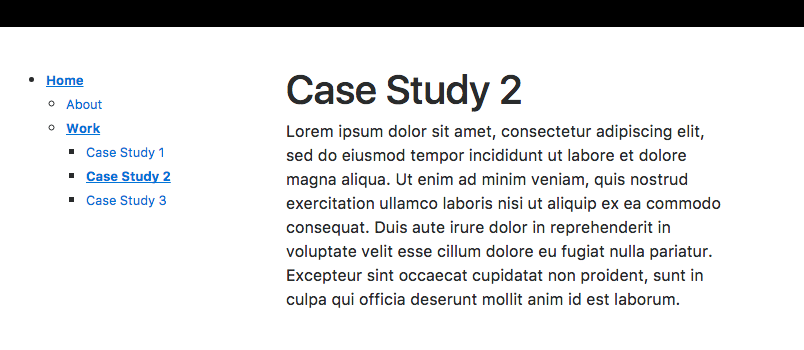

# metalsmith-directory-hierarchy

A [Metalsmith](http://metalsmith.io/) plugin that creates a new metadata item that turns matching files into a hierarchal object tree based on their folder structure.

The key use-case for this plugin is for building navigation based on your assets's folder structure.

## Installation

	npm install metalsmith-directory-hierarchy
	
## Usage

```js
var dirHierarchy = require( 'metalsmith-directory-hierarchy' );

metalsmith.use( dirHierarchy() );
```

## Options

```js
var options = {
	"name" : "hierarchy",		// the name of the metalsmith metadata property
	"test" : /\.md?$/			// regex to match files to include in hierarchy
}

metalsmith.use( dirHierarchy( options ) );
```

Defaults values for options can be found [here](./lib/defaults.js).

## Example

Given a folder structure like so:



Would produce the object below and assign it to the global metalsmith metadata object.

```json

{ 
    children:  { 
        'my-content': { 
            item: { 
                title: 'Home',
                path: 'content/index.md',
                contents: <Buffer... >,
                ...
            },
            children: { 
                'about': { 
                    item: { 
                        title: 'About',
                        path: 'content/about/index.md',
                        contents: <Buffer... >,
                        .... 
                    }
                },
                'work': { 
                    item: { 
                        title: 'Work',
                        path: 'content/work/index.md',
                        contents: <Buffer ... >,
                        ... 
                    },
                    children: { 
                        'case-study1': { 
                            item: { 
                                title: 'Case Study 1',
                                path: 'content/work/case-study1/index.md',
                                contents: <Buffer ... >,
                                ...
                            } 
                        },
                        'case-study2': { 
                            item: { 
                                title: 'Case Study 2',
                                path: 'content/work/case-study2/index.md',
                                contents: <Buffer ... >,
                                ...
                            } 
                        },
                        'case-study3': { 
                            item: { 
                                title: 'Case Study 3',
                                path: 'content/work/case-study3/index.md',
                                contents: <Buffer ... >,
                                ...
                            } 
                        }
                    }
                }
            }
        }
    }
}
```

Which would allow you to build something like this (hint: using recursive partials):

